# EXAMPLE: Getting a measure into Rally

To record a data point (e.g. coverage %) in Rally you run only on your main/master branch, read the number from your build, then ensure Rally has a metric (look it up with a GET; if missing, GET the product ref, then POST to create the metric and optional target), and finally POST the value as a new measure linked to that metric. All Rally calls use the `ZSESSIONID` header with your API key; base URL is `https://rally1.rallydev.com/slm/webservice/v2.0/`.

```mermaid
flowchart LR
    Start([Pipeline runs])
    CheckBranch{Only main branch?}
    Skip([Skip upload])
    GetValue[Get value from build]
    FindMetric["Find metric in Rally<br/>GET .../VSMProductAnalyticsMetric?query=...&fetch=true"]
    MetricExists{Found?}
    GetProduct["Get product from Rally<br/>GET .../VSMProduct?query=...&fetch=true"]
    CreateMetric["Create metric in Rally<br/>POST .../VSMProductAnalyticsMetric/create"]
    CreateTarget["Create target in Rally<br/>POST .../VSMTarget/create"]
    CreateMeasure["Create measure in Rally<br/>POST .../VSMMeasure/create"]
    Done([Measure recorded])

    Start --> CheckBranch
    CheckBranch -->|No| Skip
    CheckBranch -->|Yes| GetValue
    GetValue --> FindMetric
    FindMetric --> MetricExists
    MetricExists -->|No| GetProduct
    GetProduct --> CreateMetric
    CreateMetric --> CreateTarget
    CreateTarget --> CreateMeasure
    MetricExists -->|Yes| CreateMeasure
    CreateMeasure --> Done

    click FindMetric "#find-metric"
    click GetProduct "#get-product"
    click CreateMetric "#create-metric"
    click CreateTarget "#create-target"
    click CreateMeasure "#create-measure"
```



<details id="find-metric">
<summary><strong>Find metric in Rally</strong> — example HTTP call</summary>

```http
GET https://rally1.rallydev.com/slm/webservice/v2.0/VSMProductAnalyticsMetric?query=(Name%20%3D%20%22my-repo%3A%20Coverage%22)&fetch=true
ZSESSIONID: <your-api-key>
```

</details>

<details id="get-product">
<summary><strong>Get product from Rally</strong> — example HTTP call</summary>

```http
GET https://rally1.rallydev.com/slm/webservice/v2.0/VSMProduct?query=(%20(name%20%3D%20%22Rally%22)%20and%20(parent%20%3D%20%22https%3A%2F%2Frally1.rallydev.com%2Fslm%2Fwebservice%2Fv2.0%2FVSMProduct%2F821770618115%22)%20)&fetch=true
ZSESSIONID: <your-api-key>
```

</details>

<details id="create-metric">
<summary><strong>Create metric in Rally</strong> — example HTTP call</summary>

```http
POST https://rally1.rallydev.com/slm/webservice/v2.0/VSMProductAnalyticsMetric/create
ZSESSIONID: <your-api-key>
Content-Type: application/json

{
  "VSMProductAnalyticsMetricStory": {
    "name": "my-repo: Coverage",
    "category": "Custom",
    "product": "/VSMProduct/123456789",
    "unit": "%"
  }
}
```

</details>

<details id="create-target">
<summary><strong>Create target in Rally</strong> — example HTTP call</summary>

```http
POST https://rally1.rallydev.com/slm/webservice/v2.0/VSMTarget/create
ZSESSIONID: <your-api-key>
Content-Type: application/json

{
  "VSMTarget": {
    "Arg1": 80,
    "Metric": "/VSMProductAnalyticsMetric/123456789",
    "Operator": ">",
    "TargetDate": "2025-04-01T00:00:00.000-06:00"
  }
}
```

</details>

<details id="create-measure">
<summary><strong>Create measure in Rally</strong> — example HTTP call</summary>

```http
POST https://rally1.rallydev.com/slm/webservice/v2.0/VSMMeasure/create
ZSESSIONID: <your-api-key>
Content-Type: application/json

{
  "VSMMeasure": {
    "Value": 85.2,
    "Metric": "/VSMProductAnalyticsMetric/123456789"
  }
}
```

</details>
